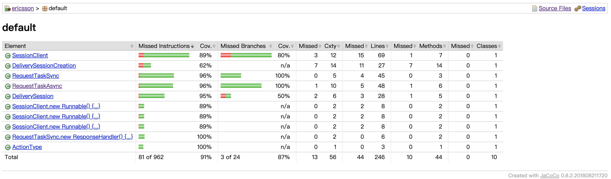

# session_controller
<h1>简介 - Introduction</h1>

会话控制器是模拟了会话定时地向服务器发送请求，包括连接请求（Start），断开请求（Stop）。实现了以下需求：

<ul>
<li>会话可以定时向服务器发送POST请求，并把会话信息以XML形式存储在POST的body里面；</li>
<li>支持多线程同时发送会话信息；</li>
<li>使用日志打印请求的信息：包括会话的ID，发送时间，请求类型（Start/Stop），请求的body（XML的String形式），返回的响应的Status code等。</li>
<li>并发情况下，线程池根据会话的数目动态调整线程数目</li>
<li>并发情况下，利用CountDownLatch来保证Main线程在所有的会话线程完成时再退出</li>
<li>支持取消会话旧Stop请求的发送，并设置新的Stop请求发送的时间</li>
<li>利用HttpClient的sendAsync()方法实现异步请求发送</li>
</ul>

<h1>客户端 - Session Client</h1>
<h2>Class介绍以及UML</h2>

<ul>
<li>DeliverySessionCreation: 会话原始类，封装了一个会话的信息；</li>
<li>DeliverySession: 为DeliverySessionCreation提供定时器；</li>
<li>RequestTaskSync: 同步任务，作为会话的定时任务，将DeliverySessionCreation的信息发送给Server；</li>
<li>RequestTaskAsync: 异步任务</li>
<li>ActionType：会话的请求类型</li>
<li>SessionClient: 多种会话发起请求的类型，程序入口（main函数）</li>
</ul>
<h2>具体功能实现</h2>
<h3>日志打印</h3>

本项目利用了org.apache.log4j包下的Logger进行日志打印。

<h3>http client 与 http request</h3>

http client与http request的实现有很多实现方式，本项目中使用了两种组合：

<ol>
  <li>RequestTaskSync中使用的是org.apache.http.client.methods包下的HttpUriRequest和org.apache.http.impl.client包下的ClosableHttpClient。ClosableHttpClient发送请求的方式是执行execute()方法；HttpUriRequest用RequestBuilder通过设置各自参数build()获得。其中，CloseableHttpClient类中利用了org.apache.commons.logging包下的Log打印日志，所以在程序运行时除了log4j的Logger打印请求信息之外，还有CloseableHttpClient自带的Log打印信息。</li>
  <li>RequestTaskAsync中使用的是java.net.http包下的HttpRequest和HttpClient，HttpClient提供的send()和sendAync()两种发送请求的方法。其中本项目主要使用sendAsync()来实现异步发送。HttpClient的sendAsync()的原理是：使用NIO来获取数据，sendAsync()返回一个CompletableFutured接口，当数据可用时，交由CompletableFuture的thenAccept()回调函数处理数据<a href="https://www.jdon.com/53011" target="_blank">（参考）</a>。但是处理数据并不是在提交请求的线程中执行的，从CompletableFuture的源码中可见，其异步实现依赖的是ForkJoinPool.commonPool()。</li>
</ol>
<h3>动态改变线程池参数</h3>

动态改变线程池参数是利用了线程池动态策略，即其可以在线程池运行期间改变线程池的参数，本项目中使用了setCorePoolSize(int size)，需要注意的是，若size的大小大于线程池的最大线程数目，我们首先需要setMaximumPoolSize(int size)。

<h3>动态改变请求Stop的时间</h3>

本项目中利用了Timer来设定请求发送的时间,TimerTask（RequestTaskAsyn和RequestTaskSync）来封装请求任务，Timer和TimerTask都有cancel()方法来取消预定任务，但是Timer的cancel()会把所有预定的Task给取消掉，这是不符合预期的，TimerTask的cancel()方法是将自身取消掉，Timer中其他的Task不受影响，所以，若需要调整Stop发送时间，可以利用TimerTask的cancel()，然后利用Timer的purge()方法将取消的任务清除掉，最后重新给Timer添加一个新的Stop任务。

<h3>DeliverySessionCreation转换为XML</h3>

使用JAXB的marhsaller将DeliverySessionCreation实例marhsal到一个XML文件，再利用BufferedReader将文件中的数据读取出来转换为String写入POST body中。

<h1>服务器端 - Session Server</h1>

若未安装Python，可在官网下载Python： <a href="https://www.python.org/downloads/" target="_blank">下载Python</a>。根据电脑的Python版本执行server.py(以Python3为例):

<pre>
<code>$ python3 server.py</code>
</pre>

<h1>测试 - Test</h1>
<h2>单元测试</h2>

由于会话请求都是定时任务，所以使用单元测试的时候，如果定时任务在@Test方法返回之前还没有执行，@Tes方法会直接退出，不会执行定时任务，所以本项目在SessionClient中的各方法中使用了CountDownLatch来保证主线程在本项Session线程退出之后再退出。本项目测试了：

<ol>
  <li>单线程发送会话：singleThreadTest()</li>
  <li>多线程发送会话，使用了线程池进行多线程并发发送会话: multipleThreadSyncTest()</li>
  <li>多线程，动态调整线程池参数: dynamicThreadPoll</li>
  <li>异步请求：asyncRequest()</li>
  <li>动态调整会话Stop时间：setStopTimeSync()</li>
</ol>
<h2>代码覆盖率</h2>

本项目代码覆盖率：<strong>74%</strong>。

本项目使用了JaCoCo-Maven插件进行代码覆盖率检测。第一步需要电脑安装Maven，第二步在pox.xml中声明Jacoco插件。

<h3>安装Maven（Mac OS版本)</h3>

从官网下载Maven：<a href="https://maven.apache.org/download.cgi" target="_blank">下载Maven</a>

配置环境：

<pre><code>vi ~/.bash_profile</code></pre>

添加路径

<pre><code>export MVN_HOME=/...(Maven解压的路径).../apache-maven-3.6.3
export PATH=$PATH:$MVN_HOME/bin</code></pre>

重新加载配置

<pre><code>source ~/.bash_profile</code></pre>

兼容zsh

<pre><code>vim ~/.zshrc
#在.zshrc最后添加
source ~/.bash_profile </code></pre>

测试Maven

<pre><code>mvn -v</code></pre>

安装Maven on linux可参考：<a href="https://blog.csdn.net/qq_38270106/article/details/97764483" target="_blank">Linux安装Maven</a>

<h3>在pox.xml配置JaCoCo插件(本项目的pox.xml中已配置)</h3>
<h3>测试代码覆盖率</h3>
<pre><code>mvn clean test</code></pre>
<h3>查看代码覆盖率</h3>

打开target/site/jacoco/路径下的index.html即可查看具体信息。

